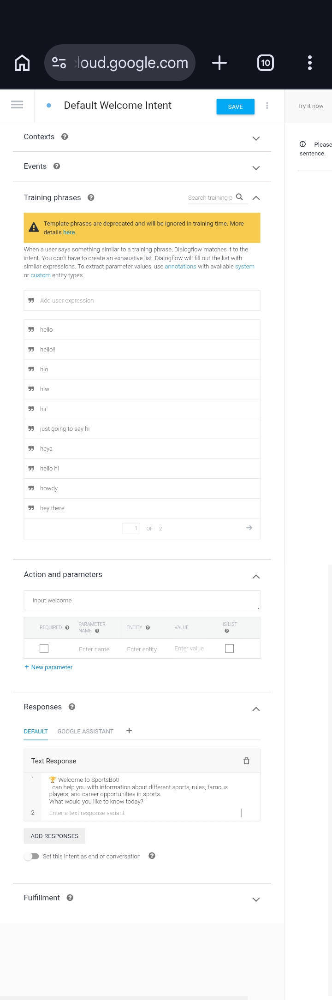
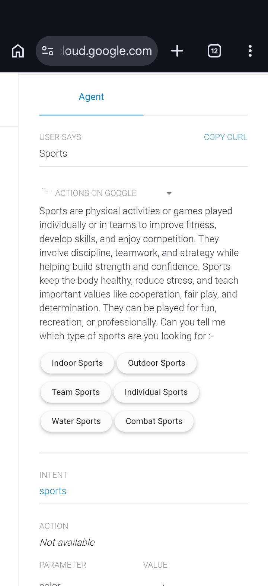

# 🏆 SportsBot – Google Dialogflow ES Chatbot

## 📌 Overview
SportsBot is a conversational chatbot built using **Google Dialogflow ES**. It helps users learn about different sports by answering sports-related questions and providing information about career opportunities in various sports.

This project was originally developed during my Class 12 as one of my first AI/NLP projects.

---

## ✨ Features
- ⚽ Answers questions about various sports
- 🏏 Provides sports-related information
- 🎯 Explains career opportunities in different sports
- 💬 Uses Google's built-in Natural Language Processing (NLP) through Dialogflow ES
- 🤖 Intent-based conversational chatbot

---

## 🛠️ Technologies Used
- Google Dialogflow ES
- Google's built-in Natural Language Processing (NLP)

---

## 📸 Screenshots

### Welcome Screen

### Chat Example

### Intents

---

## 🚀 Future Improvements
- Live sports scores using APIs
- Player statistics
- Sports news integration
- Website deployment
- Gemini/OpenAI integration for more intelligent conversations

---

## 📂 How to Use
1. Download the Dialogflow agent ZIP.
2. Import it into Google Dialogflow ES.
3. Train the agent if required.
4. Test the chatbot using the Dialogflow simulator.

---

## 👨‍💻 Author
**Nishesh Raj Singh**

LinkedIn: *(Add your LinkedIn profile here)*

GitHub: https://github.com/yashsingh-07

---

⭐ If you like this project, consider giving it a star!
